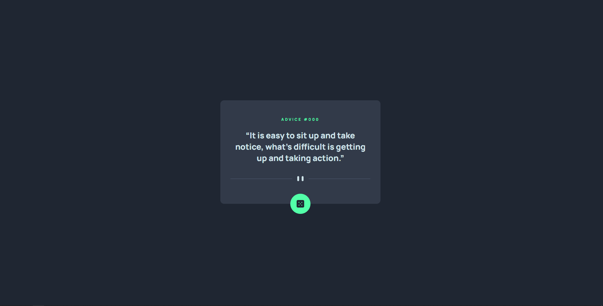

# Frontend Mentor - Advice generator app solution

This is a solution to the [Advice generator app challenge on Frontend Mentor](https://www.frontendmentor.io/challenges/advice-generator-app-QdUG-13db). Frontend Mentor challenges help you improve your coding skills by building realistic projects.

## Table of contents

- [Overview](#overview)
  - [Screenshot](#screenshot)
  - [Links](#links)
- [My process](#my-process)
  - [Built with](#built-with)
  - [What I learned](#what-i-learned)
  - [Useful resources](#useful-resources)
- [Author](#author)

## Overview

### Screenshot

### Links

- [Solution]([https://your-solution-url.com](https://www.frontendmentor.io/solutions/-advice-generator-qKPrhJPaIW))
- [Live Site]([https://your-live-site-url.com](https://kayloportal.github.io/Front-End-Mentor-Challenges/projects/junior/advice-generator-app/))

## My process

### Built with

- Semantic HTML5 markup
- CSS custom properties
- Flexbox
- CSS Grid
- Javascript
- Fetch API

### What I learned

- Fetch API
- Async & Await
- JS Promises

### Useful resources

- [Promises](https://www.youtube.com/watch?v=DHvZLI7Db8E&pp=ygULanMgcHJvbWlzZXM%3D)
- [Fetch API](https://www.youtube.com/watch?v=cuEtnrL9-H0&pp=ygUJZmV0Y2ggYXBp)

## Author

- Frontend Mentor - [@KayloPortal](https://www.frontendmentor.io/profile/KayloPortal)
- Github - [KayloPortal](https://github.com/KayloPortal)
