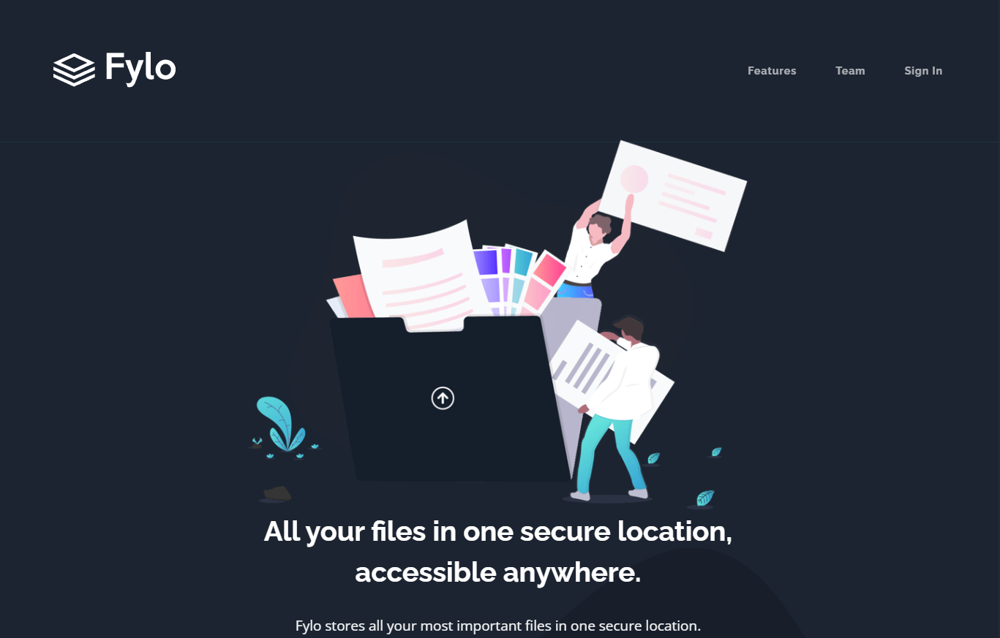

# Frontend Mentor - Fylo dark theme landing page solution

This is a solution to the [Fylo dark theme landing page challenge on Frontend Mentor](https://www.frontendmentor.io/challenges/fylo-dark-theme-landing-page-5ca5f2d21e82137ec91a50fd). Frontend Mentor challenges help you improve your coding skills by building realistic projects. 

## Table of contents

- [Overview](#overview)
  - [Screenshot](#screenshot)
  - [Links](#links)
- [My process](#my-process)
  - [Built with](#built-with)
- [Author](#author)

## Overview

### Screenshot

### Links

- Solution URL: [Solution](https://www.frontendmentor.io/home/my-challenges?tab=completed)
- Live Site URL: [Live Site](https://kayloportal.github.io/Front-End-Mentor-Challenges/projects/junior/fylo-dark-theme-landing-page/)

## My process

### Built with

- Semantic HTML5 Markup
- CSS
- Javascript

## Author

- Github - [Github](https://github.com/KayloPortal)
- Frontend Mentor - [KayloPortal](https://www.frontendmentor.io/profile/KayloPortal)
- Ponsiha - [kaylo](https://www.twitter.com/yourusername)
