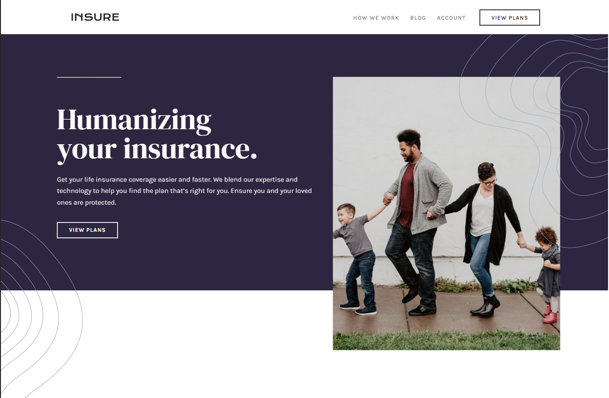

# Frontend Mentor - Insure landing page solution

This is a solution to the [Insure landing page challenge on Frontend Mentor](https://www.frontendmentor.io/challenges/insure-landing-page-uTU68JV8). Frontend Mentor challenges help you improve your coding skills by building realistic projects. 

## Table of contents

- [Overview](#overview)
  - [Screenshot](#screenshot)
  - [Links](#links)
- [My process](#my-process)
  - [Built with](#built-with)
  - [What I learned](#what-i-learned)
  - [Useful resources](#useful-resources)
- [Author](#author)
- [Acknowledgments](#acknowledgments)

## Overview

### Screenshot

### Links

- [Solution URL](https://github.com/KayloPortal/Front-End-Mentor-Challenges/tree/main/projects/junior/insure-landing-page)
- [Live Site URL](https://kayloportal.github.io/Front-End-Mentor-Challenges/projects/junior/insure-landing-page/)

## My process

### Built with

- Semantic HTML5 markup
- CSS custom properties
- Flexbox
- CSS Grid
- Mobile-first workflow
- JS

### What I learned

### Useful resources

- [resource](https://www.example.com](https://www.youtube.com/results?search_query=toggle+button+css+js) - Helped me in some toggle button issues.
- [resource](https://www.example.com](https://www.youtube.com/watch?v=gzCUq_VQ7Y8&t=22s) - Helped me in animting toggle button.

## Author

- Frontend Mentor - [@KayloPortal](https://www.frontendmentor.io/profile/KayloPortal)

