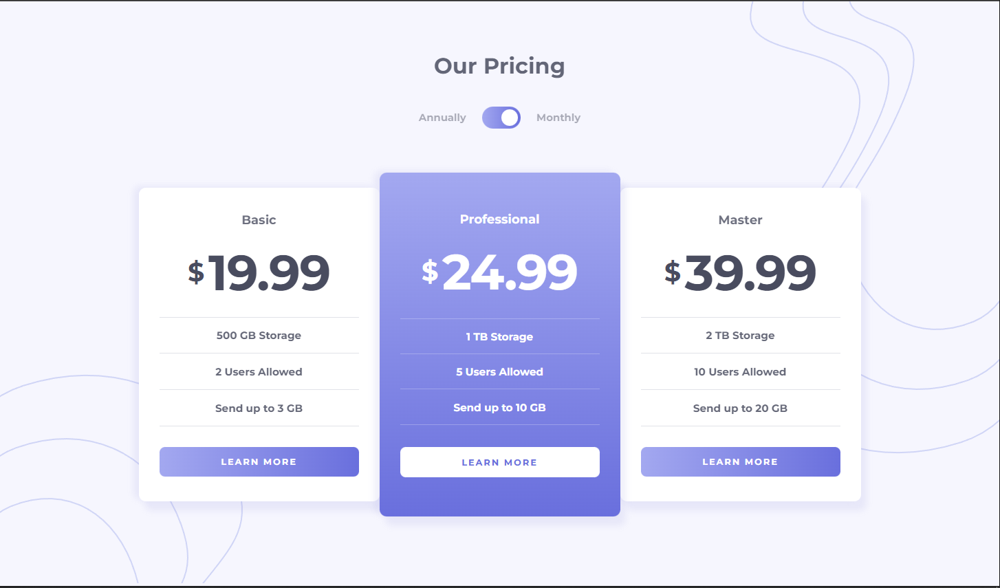

# Frontend Mentor - Pricing component with toggle solution

This is a solution to the [Pricing component with toggle challenge on Frontend Mentor](https://www.frontendmentor.io/challenges/pricing-component-with-toggle-8vPwRMIC). Frontend Mentor challenges help you improve your coding skills by building realistic projects. 

## Table of contents

- [Overview](#overview)
  - [Screenshot](#screenshot)
  - [Links](#links)
- [My process](#my-process)
  - [Built with](#built-with)
  - [What I learned](#what-i-learned)
  - [Useful resources](#useful-resources)
- [Author](#author)

## Overview

### Screenshot

### Links

- Solution URL: [Add solution URL here](https://your-solution-url.com)
- Live Site URL: [Add live site URL here](https://kayloportal.github.io/Front-End-Mentor-Challenges/projects/junior/pricing-component-with-toggle/)

## My process

### Built with

- Semantic HTML5 markup
- CSS custom properties
- Flexbox
- CSS Grid
- Javascript

### What I learned

- Working with responsive layouts
- Toggle Components
- Event Debuging

### Useful resources

- [JS Eventt Bubbling](https://dev.to/0shuvo0/event-bubbling-capturing-and-how-to-prevent-them-9n5) - Helped me at event debugging, short and useful.

## Author

- Account - [Kaylo](https://github.com/KayloPortal)
- Frontend Mentor - [@KayloPorta](https://www.frontendmentor.io/profile/KayloPortal)
- Twitter - [@yourusername](https://www.twitter.com/yourusername)
